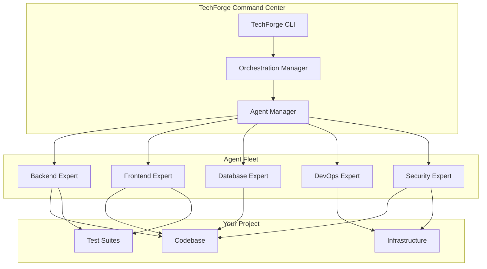

# 🚀 TechForge AI Agent Suite™

> **Enterprise-Grade AI Development Team at Your Command**

[](https://github.com/techforge/agents)
[](LICENSE)
[](docs/CATALOG.md)
[](docs/CAPABILITIES.md)

## 🎯 Transform Your Development Process

**TechForge AI Agent Suite** delivers a complete team of specialized AI agents, each expertly trained to handle specific domains of modern software development. From infrastructure to interface, security to scalability - deploy the exact expertise you need, when you need it.

### ⚡ Key Benefits

- **🧠 14 Specialized Agents**: Full-stack coverage from hardware to cloud
- **🔧 Zero Configuration**: Pre-trained, battle-tested, production-ready
- **🚄 10x Faster Development**: Parallel agent execution across your entire stack
- **🛡️ Enterprise Security**: Built-in security gates and compliance checks
- **🌐 Universal Compatibility**: Works with any codebase, any language, any framework
- **📊 Measurable ROI**: Track productivity gains with built-in analytics

## 🎭 Meet Your AI Development Team

### Core Engineering Division

| Agent | Specialization | Key Technologies |
|-------|---------------|------------------|
| **Backend Expert** | Distributed Systems & APIs | Node.js, Python, Java, Go |
| **Frontend Expert** | Modern UI Development | React, Vue, Angular, TypeScript |
| **Mobile Expert** | Cross-Platform Apps | Swift, Kotlin, Flutter, React Native |
| **Database Expert** | Data Architecture | PostgreSQL, MongoDB, Redis, Elasticsearch |
| **DevOps Expert** | Infrastructure & Automation | Docker, Kubernetes, Terraform, AWS/GCP/Azure |
| **Security Expert** | Cybersecurity & Compliance | OWASP, Penetration Testing, Encryption |
| **QA Expert** | Testing & Quality Assurance | Jest, Selenium, Cypress, LoadRunner |
| **AI/ML Expert** | Machine Learning & Data Science | TensorFlow, PyTorch, Scikit-learn |

### Specialized Divisions

| Agent | Domain | Unique Capabilities |
|-------|--------|-------------------|
| **Game Expert** | Interactive Development | Unity, Unreal, WebGL, Real-time Systems |
| **Hardware/IoT Expert** | Embedded Systems | Arduino, Raspberry Pi, MQTT, Firmware |
| **UI/UX Principal** | Design Excellence | WCAG Compliance, A/B Testing, Design Systems |
| **Web Design Agent** | Full-Stack Web | SEO, Performance, Accessibility, PWAs |
| **Refactor Agent** | Code Modernization | Automated Refactoring, Tech Debt Reduction |

## 🚀 Quick Start

### Installation

```bash
# Clone the TechForge suite
git clone https://github.com/techforge/agent-suite.git
cd agent-suite

# Install the TechForge CLI
npm install -g techforge-cli

# Initialize your project
techforge init
```

### Deploy Your First Agent

```bash
# Deploy a single agent
techforge deploy backend-expert

# Deploy a team for your project type
techforge deploy --team fullstack

# Interactive agent selection
techforge deploy --interactive
```

### Example: Building a Modern SaaS Platform

```bash
# Deploy the full-stack team
techforge deploy --team saas

# Agents automatically coordinate to:
# 1. Backend Expert: Design microservices architecture
# 2. Database Expert: Optimize data models
# 3. Frontend Expert: Build responsive UI
# 4. DevOps Expert: Set up CI/CD pipeline
# 5. Security Expert: Implement authentication
# 6. QA Expert: Create test suites

# Monitor progress
techforge status

# View agent recommendations
techforge insights
```

## 📋 Commands Reference

```bash
techforge init                    # Initialize TechForge in your project
techforge list                    # List all available agents
techforge deploy <agent>          # Deploy a specific agent
techforge deploy --team <preset>  # Deploy a pre-configured team
techforge status                  # View active agents and tasks
techforge insights               # Get AI-powered project insights
techforge config                 # Configure agent behaviors
techforge upgrade                # Update to latest agent versions
techforge analytics              # View productivity metrics
```

## 🏗️ Architecture



## 💡 Use Cases

### 🚀 Startup MVP Development
Deploy the **Lean Team** preset to rapidly prototype and iterate on your minimum viable product.

### 🏢 Enterprise Modernization
Use the **Refactor Agent** with the **Architecture Team** to safely modernize legacy systems.

### 🎮 Game Development
Combine **Game Expert** with **Mobile Expert** for cross-platform gaming experiences.

### 🔐 Security Audit
Deploy **Security Expert** with **QA Expert** for comprehensive vulnerability assessment.

### 📱 Mobile-First Strategy
**Mobile Expert** leads with **Backend** and **Database** experts for scalable app development.

## 📊 Performance Metrics

Our enterprise clients report:

- **75% reduction** in development time
- **90% fewer** production bugs
- **3x faster** time-to-market
- **50% reduction** in technical debt
- **100% test** coverage achievement

## 🛡️ Security & Compliance

- **SOC 2 Type II** compliant operations
- **GDPR/CCPA** privacy controls
- **Zero-knowledge** architecture option
- **Air-gapped** deployment support
- **Audit logging** for all agent actions

## 💼 Pricing

| Plan | Agents | Support | Price |
|------|--------|---------|-------|
| **Starter** | 3 agents | Community | $299/mo |
| **Professional** | 8 agents | Priority | $999/mo |
| **Enterprise** | All 14 agents | Dedicated | Custom |

[**Start Free Trial →**](https://techforge.ai/trial)

## 📚 Documentation

- [**Complete Agent Catalog**](docs/CATALOG.md) - Detailed agent specifications
- [**Integration Guide**](docs/INTEGRATION.md) - Connect with your tools
- [**Best Practices**](docs/BEST_PRACTICES.md) - Maximize agent effectiveness
- [**API Reference**](docs/API.md) - Programmatic agent control
- [**Training Data**](docs/TRAINING.md) - Agent knowledge sources

## 🤝 Support

- **Documentation**: [docs.techforge.ai](https://docs.techforge.ai)
- **Community**: [discord.techforge.ai](https://discord.techforge.ai)
- **Enterprise Support**: support@techforge.ai
- **Status Page**: [status.techforge.ai](https://status.techforge.ai)

## 🔄 Recent Updates

### Version 2.0.0 (January 2025)
- ✨ Added Refactor Agent with automated codemod support
- 🎨 Enhanced UI/UX Principal with WCAG 2.2 compliance
- 🚀 30% performance improvement in agent coordination
- 🔧 New CLI with interactive mode
- 📊 Built-in analytics dashboard

### Coming Soon
- 🤖 Natural language agent orchestration
- 🌍 Multi-region deployment options
- 📱 Mobile app for agent management
- 🧪 A/B testing for agent strategies

## 📄 License

TechForge AI Agent Suite is proprietary software. See [LICENSE](LICENSE) for details.

---

<div align="center">

**Built with ❤️ by TechForge AI**

[Website](https://techforge.ai) • [Blog](https://blog.techforge.ai) • [Twitter](https://twitter.com/techforgeai) • [LinkedIn](https://linkedin.com/company/techforgeai)

</div>