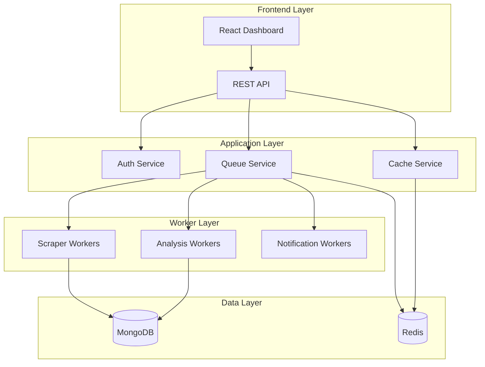

# 🎯 Opportunity Scanner v2.0

**AI-Powered Business Opportunity Discovery Platform**

[](https://github.com/yourusername/opportunity-scanner)
[](LICENSE)
[](https://nodejs.org)

Transform public discussions into actionable business insights with enterprise-grade AI pattern recognition, real-time analytics, and scalable microservices architecture.

## ✨ What's New in v2.0

- 🏗️ **Microservices Architecture**: Scalable backend with Redis queues and worker processes
- 🔒 **Enterprise Security**: JWT authentication, role-based access, API rate limiting
- 📊 **Advanced Analytics**: Real-time dashboards with WebSocket updates
- 🐳 **Container-Ready**: Docker Compose and Kubernetes deployment configs
- 🎨 **Modern UI**: Enhanced React dashboard with TypeScript and real-time updates
- 🔍 **Smart Filtering**: Advanced search, categorization, and bulk operations
- 📈 **Performance Monitoring**: Prometheus metrics and Grafana dashboards

## 🚀 Quick Start

### Prerequisites
- Node.js 18+
- Docker & Docker Compose
- MongoDB & Redis (or use Docker)
- Reddit API credentials

### 1. Installation

```bash
# Clone the repository
git clone https://github.com/yourusername/opportunity-scanner.git
cd opportunity-scanner

# Install dependencies
npm install

# Copy environment template
cp .env.example .env
# Edit .env with your credentials
```

### 2. Configuration

```bash
# Required environment variables
REDDIT_CLIENT_ID=your_reddit_client_id
REDDIT_CLIENT_SECRET=your_reddit_client_secret
REDDIT_REFRESH_TOKEN=your_reddit_refresh_token
JWT_SECRET=your_super_secret_jwt_key
MONGODB_URI=mongodb://localhost:27017/opportunity-scanner
REDIS_URL=redis://localhost:6379
```

### 3. Start with Docker (Recommended)

```bash
# Development environment
docker-compose -f docker-compose.dev.yml up

# Production environment
docker-compose up -d
```

### 4. Manual Setup

```bash
# Start MongoDB and Redis
# Then run:

# Database migration
npm run migrate

# Start the application
npm run dev

# Start worker processes (in another terminal)
npm run worker

# Start web dashboard (in another terminal)
npm run web:dev
```

### 5. Access the Platform

- **Web Dashboard**: http://localhost:3000
- **API Documentation**: http://localhost:3000/api/docs
- **Monitoring**: http://localhost:3001 (Grafana)
- **Metrics**: http://localhost:9090 (Prometheus)

## 🏗️ Architecture Overview



## 🔧 Core Features

### 🤖 AI-Powered Pattern Recognition
- **Advanced NLP**: Identifies opportunity signals in natural language
- **Sentiment Analysis**: Measures frustration and urgency levels  
- **Context Extraction**: Captures surrounding conversation context
- **Multi-Pattern Detection**: Recognizes various opportunity expressions

### 📊 Real-Time Analytics Dashboard
- **Live Updates**: WebSocket-powered real-time opportunity feed
- **Smart Filtering**: Category, score, timeframe, and keyword filters
- **Bulk Operations**: Mass review, archive, and export capabilities
- **Performance Metrics**: Processing time, accuracy, and throughput stats

### 🔒 Enterprise Security
- **JWT Authentication**: Secure token-based auth with refresh tokens
- **Role-Based Access**: Admin, Analyst, and Viewer permission levels
- **API Rate Limiting**: Configurable limits per user/endpoint
- **Input Validation**: Comprehensive data sanitization and validation

### 🚀 Scalable Infrastructure
- **Microservices**: Separate services for scraping, analysis, and notifications
- **Queue System**: Redis-backed job processing with Bull queues
- **Caching Layer**: Multi-level caching for performance optimization
- **Container Ready**: Docker and Kubernetes deployment configurations

## 📋 API Endpoints

### Authentication
```bash
POST /api/auth/register    # Register new user
POST /api/auth/login       # User login
POST /api/auth/refresh     # Refresh tokens
GET  /api/auth/profile     # Get user profile
```

### Opportunities
```bash
GET    /api/opportunities           # List opportunities
GET    /api/opportunities/:id       # Get specific opportunity
PATCH  /api/opportunities/:id       # Update opportunity
POST   /api/opportunities/bulk      # Bulk operations
GET    /api/opportunities/export    # Export data
```

### Analytics
```bash
GET /api/analytics/stats      # Platform statistics
GET /api/analytics/trends     # Trending categories
GET /api/analytics/performance # Performance metrics
```

### Admin
```bash
POST /api/admin/scan         # Trigger manual scan
GET  /api/admin/queues       # Queue status
GET  /api/admin/users        # User management
```

## 🛠️ Development

### Project Structure
```
opportunity-scanner/
├── src/
│   ├── collectors/          # Data collection services
│   ├── analyzers/           # AI analysis engines
│   ├── services/            # Core business logic
│   ├── middleware/          # Express middleware
│   ├── routes/              # API route handlers
│   └── models/              # Database schemas
├── web/
│   ├── components/          # React components
│   ├── pages/               # Next.js pages
│   └── hooks/               # Custom React hooks
├── k8s/                     # Kubernetes configs
├── config/                  # Configuration files
└── scripts/                 # Utility scripts
```

### Running Tests
```bash
npm test                 # Run test suite
npm run test:watch       # Watch mode
npm run test:coverage    # Coverage report
```

### Code Quality
```bash
npm run lint            # ESLint check
npm run lint:fix        # Auto-fix issues
```

## 🚀 Deployment

### Docker Deployment
```bash
# Build production image
npm run docker:build

# Deploy with Docker Compose
npm run docker:prod
```

### Kubernetes Deployment
```bash
# Apply configurations
npm run k8s:deploy

# Check deployment status
kubectl get pods -n opportunity-scanner
```

### Environment-Specific Configs
- **Development**: `docker-compose.dev.yml`
- **Production**: `docker-compose.yml`
- **Kubernetes**: `k8s/deployment.yaml`

## 📊 Monitoring & Observability

### Metrics Collection
- **Application Metrics**: Request latency, error rates, throughput
- **Business Metrics**: Opportunities processed, accuracy scores
- **Infrastructure Metrics**: CPU, memory, disk usage

### Logging
- **Structured Logging**: JSON format with correlation IDs
- **Log Levels**: Error, warn, info, debug
- **Log Aggregation**: Centralized logging with retention policies

### Health Checks
- **Liveness Probes**: Application health status
- **Readiness Probes**: Service availability checks
- **Dependency Checks**: Database and Redis connectivity

## 🔍 Pattern Detection Examples

The system recognizes various opportunity patterns:

### Need Expressions
- "I wish there was a tool that..."
- "We really need something to..."
- "I can't find any solution for..."

### Problem Statements  
- "The biggest problem with X is..."
- "It's so frustrating that..."
- "Why doesn't anyone build..."

### Solution Requests
- "Someone should create..."
- "It would be awesome if..."
- "Wouldn't it be great to have..."

## 🤝 Contributing

We welcome contributions! Please see our [Contributing Guide](CONTRIBUTING.md) for details.

### Development Setup
1. Fork the repository
2. Create a feature branch
3. Make your changes
4. Add tests
5. Submit a pull request

## 📄 License

This project is licensed under the MIT License - see the [LICENSE](LICENSE) file for details.

## 🙏 Acknowledgments

- **TechForge AI Agent Suite**: Enterprise development framework
- **Reddit API**: Public discussion data source
- **Natural.js**: Natural language processing library
- **Bull**: Redis-based job queue system

---

<div align="center">

**Built with ❤️ using TechForge AI Agent Suite**

[Documentation](docs/) • [API Reference](docs/api.md) • [Support](mailto:support@yourcompany.com)

</div>